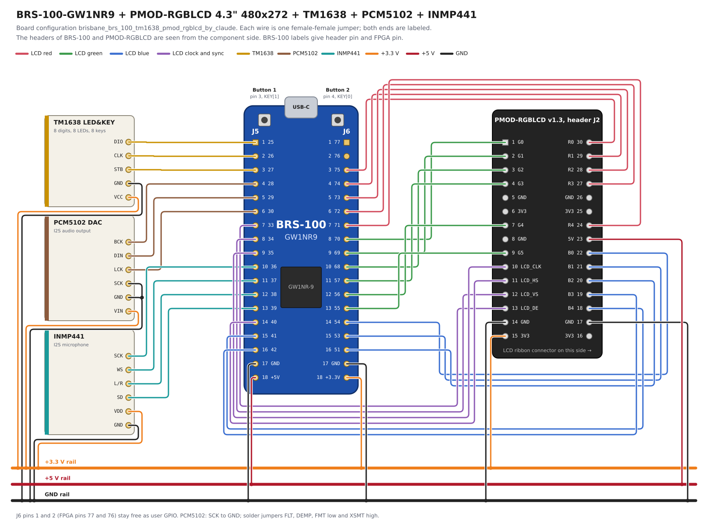

# BRS-100-GW1NR9 with PMOD-RGBLCD, TM1638, PCM5102 and INMP441

Board configuration `brisbane_brs_100_tm1638_pmod_rgblcd_by_claude`.

[board_specific.cst](board_specific.cst) is the constraint file of the board
manufacturer, unchanged: it names the header pins `pad_io[1]` to `pad_io[32]`
and sets their I/O standard, pull and drive. All of them are `inout` ports of
[board_specific_top.sv](board_specific_top.sv), which decides which header pin
carries which LCD, TM1638, DAC or microphone signal. This follows the rule of
the repository: keep the manufacturer's .cst, .xdc or .qsf file and do the pin
mapping in board_specific_top.sv. The configuration
[brisbane_brs_100_tm1638_pmod_rgblcd_by_claude_alt](../brisbane_brs_100_tm1638_pmod_rgblcd_by_claude_alt)
has the same wiring and maps the pins in its .cst file instead.

[BRS-100-GW1NR9](https://brisbanesilicon.com.au/brs-100-gw1nr9/) by
BrisbaneSilicon carries the same Gowin GW1NR-9 FPGA as Tang Nano 9K,
a 27 MHz oscillator, 6 LEDs, 2 buttons, a USB-C port with JTAG and UART,
and 32 user I/O pins on two 18-pin headers, J5 and J6. It has no LCD or HDMI
connector, so this configuration connects with jumper wires:

* [MuseLab PMOD-RGBLCD](https://www.tindie.com/products/johnnywu/pmod-rgblcd-expansion-board/)
  adapter with a 4.3" 480x272 RGB LCD, the same resolution and timing as
  `tang_nano_9k_lcd_480_272_tm1638`
  ([schematic](https://github.com/wuxx/icesugar/blob/master/schematic/pmod-rgblcd-v1.3.pdf));
* TM1638 "LED&KEY" module with 8 seven-segment digits, 8 LEDs and 8 keys;
* PCM5102 I2S DAC module for the sound output;
* INMP441 I2S microphone module.

These use 30 of the 32 header pins. J6 pins 1 and 2 remain as `gpio[1:0]`
for the labs. The design is the Tang Nano 9K design: every function uses the
same FPGA pin as `tang_nano_9k_lcd_480_272_tm1638`.

## Wiring



The same picture as a vector file: [wiring.svg](wiring.svg).

BRS-100 has one +3.3 V pin (J6.18), one +5 V pin (J5.18) and two GND pins
(J5.17, J6.17), while the four modules need 3.3 V and GND each and the LCD
backlight needs 5 V. Connect the BRS-100 power pins to the power rails of a
breadboard, or use jumper splitters, and take the module power from there:

| Rail    | From BRS-100 | To                                                    |
|---------|--------------|-------------------------------------------------------|
| +3.3 V  | J6.18        | PMOD-RGBLCD J2.15, TM1638 VCC, PCM5102 VIN, INMP441 VDD |
| +5 V    | J5.18        | PMOD-RGBLCD J2.23 (LCD backlight)                     |
| GND     | J5.17, J6.17 | PMOD-RGBLCD J2.14 and J2.17, TM1638 GND, PCM5102 GND and SCK, INMP441 GND |

Power TM1638 from 3.3 V, not from 5 V: its DIO line drives an FPGA pin.

### J5

| J5 | FPGA | Port         | Use             | Connect to         |
|---:|-----:|--------------|-----------------|--------------------|
|  1 |   25 | `pad_io[1]`  | `TM1638_DIO`    | TM1638 DIO         |
|  2 |   26 | `pad_io[2]`  | `TM1638_CLK`    | TM1638 CLK         |
|  3 |   27 | `pad_io[3]`  | `TM1638_STB`    | TM1638 STB         |
|  4 |   28 | `pad_io[4]`  | `DAC_BCK`       | PCM5102 BCK        |
|  5 |   29 | `pad_io[5]`  | `DAC_DIN`       | PCM5102 DIN        |
|  6 |   30 | `pad_io[6]`  | `DAC_LCK`       | PCM5102 LCK        |
|  7 |   33 | `pad_io[7]`  | `LCD_DE`        | PMOD-RGBLCD J2.13 LCD_DE |
|  8 |   34 | `pad_io[8]`  | `LCD_VS`        | PMOD-RGBLCD J2.12 LCD_VS |
|  9 |   35 | `pad_io[9]`  | `LCD_CK`        | PMOD-RGBLCD J2.10 LCD_CLK |
| 10 |   36 | `pad_io[10]` | `MIC_SCK`       | INMP441 SCK        |
| 11 |   37 | `pad_io[11]` | `MIC_WS`        | INMP441 WS         |
| 12 |   38 | `pad_io[12]` | `MIC_LR`        | INMP441 L/R        |
| 13 |   39 | `pad_io[13]` | `MIC_SD`        | INMP441 SD         |
| 14 |   40 | `pad_io[14]` | `LCD_HS`        | PMOD-RGBLCD J2.11 LCD_HS |
| 15 |   41 | `pad_io[15]` | `LCD_B[7]`      | PMOD-RGBLCD J2.18 B4 |
| 16 |   42 | `pad_io[16]` | `LCD_B[6]`      | PMOD-RGBLCD J2.19 B3 |
| 17 |  GND | GND          |                 | GND rail           |
| 18 | +5 V | +5 V         |                 | +5 V rail          |

### J6

| J6 | FPGA  | Port         | Use             | Connect to         |
|---:|------:|--------------|-----------------|--------------------|
|  1 |    77 | `pad_io[17]` | `GPIO[0]`       | free, `gpio[0]` of the labs |
|  2 |    76 | `pad_io[18]` | `GPIO[1]`       | free, `gpio[1]` of the labs |
|  3 |    75 | `pad_io[19]` | `LCD_R[3]`      | PMOD-RGBLCD J2.30 R0 |
|  4 |    74 | `pad_io[20]` | `LCD_R[4]`      | PMOD-RGBLCD J2.29 R1 |
|  5 |    73 | `pad_io[21]` | `LCD_R[5]`      | PMOD-RGBLCD J2.28 R2 |
|  6 |    72 | `pad_io[22]` | `LCD_R[6]`      | PMOD-RGBLCD J2.27 R3 |
|  7 |    71 | `pad_io[23]` | `LCD_R[7]`      | PMOD-RGBLCD J2.24 R4 |
|  8 |    70 | `pad_io[24]` | `LCD_G[2]`      | PMOD-RGBLCD J2.1 G0 |
|  9 |    69 | `pad_io[25]` | `LCD_G[3]`      | PMOD-RGBLCD J2.2 G1 |
| 10 |    68 | `pad_io[26]` | `LCD_G[4]`      | PMOD-RGBLCD J2.3 G2 |
| 11 |    57 | `pad_io[27]` | `LCD_G[5]`      | PMOD-RGBLCD J2.4 G3 |
| 12 |    56 | `pad_io[28]` | `LCD_G[6]`      | PMOD-RGBLCD J2.7 G4 |
| 13 |    55 | `pad_io[29]` | `LCD_G[7]`      | PMOD-RGBLCD J2.9 G5 |
| 14 |    54 | `pad_io[30]` | `LCD_B[3]`      | PMOD-RGBLCD J2.22 B0 |
| 15 |    53 | `pad_io[31]` | `LCD_B[4]`      | PMOD-RGBLCD J2.21 B1 |
| 16 |    51 | `pad_io[32]` | `LCD_B[5]`      | PMOD-RGBLCD J2.20 B2 |
| 17 |   GND | GND          |                 | GND rail           |
| 18 | +3.3 V | +3.3 V       |                | +3.3 V rail        |

### PMOD-RGBLCD header J2

J2 is a 2x15 male header made for the iCESugar boards; it is not a standard
12-pin PMOD. Looking at the component side with the LCD ribbon connector on
the right, pin 1 is the square pad at the top of the left column. The left
column is pins 1 to 15 from the top, the right column is pins 30 to 16 from
the top, so pin 30 is next to pin 1. The GND pads are in rows 5 and 14.

| Row | Left pin | Signal  | Right pin | Signal |
|----:|---------:|---------|----------:|--------|
|   1 |        1 | G0      |        30 | R0     |
|   2 |        2 | G1      |        29 | R1     |
|   3 |        3 | G2      |        28 | R2     |
|   4 |        4 | G3      |        27 | R3     |
|   5 |        5 | GND     |        26 | GND    |
|   6 |        6 | 3V3     |        25 | 3V3    |
|   7 |        7 | G4      |        24 | R4     |
|   8 |        8 | GND, through R3 |  23 | 5V, through R4 |
|   9 |        9 | G5      |        22 | B0     |
|  10 |       10 | LCD_CLK |        21 | B1     |
|  11 |       11 | LCD_HS  |        20 | B2     |
|  12 |       12 | LCD_VS  |        19 | B3     |
|  13 |       13 | LCD_DE  |        18 | B4     |
|  14 |       14 | GND     |        17 | GND    |
|  15 |       15 | 3V3     |        16 | 3V3    |

The adapter connects R0, G0 and B0 to the lower bits of the 24-bit LCD
interface as well, and ties the LCD DISP pin to 3.3 V. Its boost converter
for the backlight runs from 5 V on pin 23. Check that the solder bridges
SB1 to SB4 are open: each of them shorts two color bits.

### PCM5102 and INMP441

Connect the SCK pin of PCM5102 to GND; the DAC then makes its own system
clock. As `peripherals/i2s_audio_out.sv` says, XSMT should be high and FLT,
DEMP and FMT low. Check the solder jumpers H1L to H4L on the back of the usual
purple PCM5102 module: FLT, DEMP and FMT to L, XSMT to H.

The FPGA drives INMP441 L/R low, as on Tang Nano 9K. You may instead connect
L/R to GND and leave J5.12 free.

## Buttons and LEDs

| BRS-100      | FPGA | Signal   | Use                                         |
|--------------|-----:|----------|---------------------------------------------|
| Button 1     |    3 | `KEY[1]` | Reset with TM1638 connected; `key[0]` without |
| Button 2     |    4 | `KEY[0]` | Reset with TM1638 connected; `key[1]` without |
| LED1 to LED6 | 16, 15, 14, 13, 11, 10 | `LED[5:0]` | `led` of the labs, in the same order as on Tang Nano 9K |

`KEY` and `LED` are wires in board_specific_top.sv that put the ports
`pad_user_buttons_n` and `pad_leds_n` of the manufacturer into the order of
Tang Nano 9K. Button 1 is the one next to header pin 1. With TM1638 connected, as in this
configuration, the labs take their keys from TM1638 and either BRS-100 button
resets the design, the same as on Tang Nano 9K.

## Constraints of the manufacturer

board_specific.cst gives every header pin `IO_TYPE=LVCMOS33`, a pull-down and
`DRIVE=8`. The constraints of `_alt` and of `tang_nano_9k_lcd_480_272_tm1638`
give no I/O type, and Gowin reports those pins as LVCMOS18 with a pull-up.

Gowin refuses `DRIVE` on a pin that the design uses only as an input, here
`pad_io[13]`, the microphone data. Instead of editing the file of the
manufacturer, [board_specific.tcl](board_specific.tcl) sets
`-cst_warn_to_error 0`, so that this message, CT1108, stays a warning. The
same holds for the two lab GPIO pins when a lab only reads them. The other
side of this setting is that a mistyped port name in a constraint file also
stays a warning.

The LCD pixel clock is constrained on its output port `pad_io[9]` in
[board_specific.sdc](board_specific.sdc), as Tang Nano 9K constrains its LCD
clock port, so the constraint exists also in labs without graphics.

## FPGA part

BRS-100 carries GW1NR-LV9QN88PC7/I6. Gowin EDA Education edition lists only
GW1NR-LV9QN88PC6/I5, the Tang Nano 9K part, so
[board_specific.tcl](board_specific.tcl) uses that. It is the same GW1NR-9C
die in a slower speed grade; the timing report is pessimistic for BRS-100.
The board_specific.tcl comment shows the line for a licensed Gowin EDA that
lists the C7/I6 part.

The scripts configure the FPGA as for Tang Nano 9K: `openFPGALoader -b
tangnano9k`, which uses the FT2232 on the first channel, or the Gowin
programmer with device GW1NR-9C. BRS-100 has the same USB IDs (0403:6010) as
the Tang Nano 9K debugger, so the same udev rules apply on Linux.

## Status

Built with Gowin EDA V1.9.9 Beta-4 Education, with the CT1108 warning above:

* `labs/2_graphics/2_3_color_stripes`;
* `labs/1_basics/1_01_and_or_not_xor_de_morgan`, without graphics;
* `labs/3_music/3_0_oscilloscope`, which uses the LCD, TM1638, microphone and
  DAC together. It uses the same logic as `_alt` and as
  `tang_nano_9k_lcd_480_272_tm1638`, every signal is on the same FPGA pin,
  and there are no timing violations. Fmax is 93.6 MHz on the 27 MHz clock
  and 104.3 MHz on the 9 MHz pixel clock; `_alt` reaches 97.5 MHz on the
  27 MHz clock, the difference coming from the LVCMOS33 pins.

Not yet tried on a real board.

## Regenerating the wiring diagram

The diagram comes from [generate_wiring_diagram.py](generate_wiring_diagram.py),
which holds a copy of the pin data; keep it in step with board_specific_top.sv.

```bash
python3 generate_wiring_diagram.py
inkscape wiring.svg --export-type=png --export-dpi=96 \
    --export-background=white --export-filename=wiring.png
```

## Sources

* [location.cst](https://github.com/BrisbaneSilicon/BRS-100-GW1NR9/blob/cd0bcbf1c24ae6c567346271b2f94c26927d5c5f/build/platforms/gowin/devices/GW1NR-9/C7I6/constraints/location.cst),
  the source of board_specific.cst.
* BRS-100-GW1NR9 [pinout](https://brisbanesilicon.com.au/docs/BRS-100-GW1NR9_Pinout.pdf),
  [schematic](https://brisbanesilicon.com.au/docs/BRS-100-GW1NR9_Schematic.pdf),
  [datasheet](https://brisbanesilicon.com.au/docs/BRS-100-GW1NR9_Datasheet.pdf)
  and [example project](https://github.com/BrisbaneSilicon/BRS-100-GW1NR9)
  with its pin constraints.
* PMOD-RGBLCD v1.3 [schematic and board drawing](https://github.com/wuxx/icesugar/blob/master/schematic/pmod-rgblcd-v1.3.pdf).
