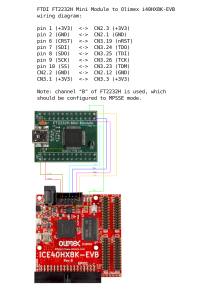

# Board specific files for Olimex iCE40HX8K-EVB board

Olimex [iCE40HX8K-EVB](https://www.olimex.com/Products/FPGA/iCE40/iCE40HX8K-EVB/open-source-hardware) is open source board based on Lattice iCE40 FPGA series with 7680 LUTs.

This board can be flashed using either [iceprog](https://github.com/YosysHQ/icestorm/tree/master/iceprog) or [openFPGALoader](https://github.com/trabucayre/openFPGALoader). For doing that two things required: a supported JTAG adapter and proper cable soldered. JTAG adapters based on FTDI chips (mainly FT2232) are whidely use in open source community. Here below we provide a wiring diagram for JTAG cable that can be used to connect [FTDI FT2232H Mini Module](https://ftdichip.com/products/ft2232h-mini-module/) to Olimex iCE40HX8K-EVB board. One can use this cable to flash other boards with some midifications (connect TDM, TDI, TDO, TCK and nRST signals correctly).

## Wiring diagram

