# Vivado Installation Guide to run SystemVerilog Examples for Basic-Graphics-Music

In today's fast-paced tech landscape, the journey from academic learning to industry application can be daunting for many students. While academic curriculam provide a solid foundation in theoretical knowledge, the transition to real-world, industry-level skills often requires additional hands-on experience and practical insights.

This is where [Basic-Graphics-Music](https://github.com/yuri-panchul/basics-graphics-music/tree/main) GitHub repository comes into play. Designed with the goal of bridging this crucial gap, the repository offers a series of comprehensive examples in SystemVerilog. These examples are crafted to help students and emerging professionals translate their academic knowledge into practical, industry-relevant skills.

By following these examples, you'll gain a deeper understanding of how SystemVerilog is used in professional environments, enhancing your ability to tackle complex design challenges.

## Download Vivado

Navigate to the Xilinx [Download page](https://www.xilinx.com/support/download.html?_ga=2.260602445.115923376.1607278706-574785482.1605024210) and click on the Xilinx Unified Installer 2022.2: Linux Self Extracting Web installer, this should be redirected to the login page. Log in with the Xilinx Account and download the file.

### Run The Installer

- To run the unified installer, it must first be converted to an executable file.
```
$chmod -x Xilinx_Unified_2022.2_1014_8888_Lin64.bin
```
- After making the file executable run the installer with root permissions.
```
$sudo ./Xilinx_Unified_2022.2_1014_8888_lin64.bin
```
This will open the installer GUI in a new window.

## Vivado Installer GUI

The welcome screen of the installer GUI provides a reminder of the supported OS version.

<p align="center">
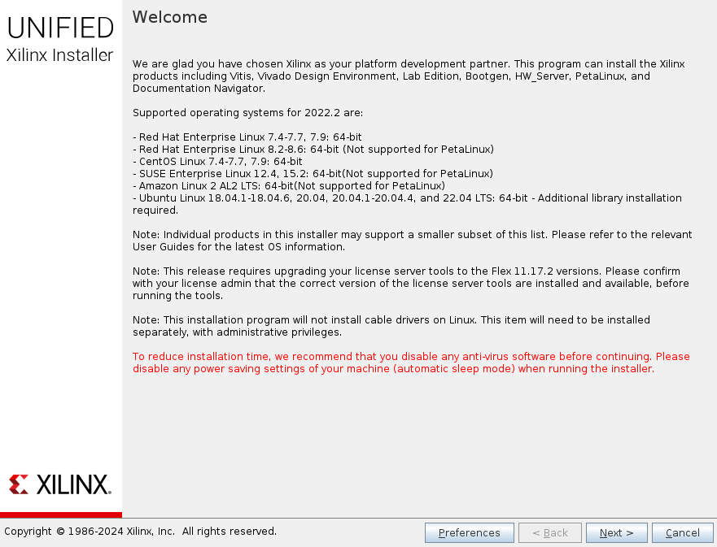
</p>


Click Next, to proceed. The next window requires the user to provide the account credentials. The same account credentials were used at the beginning to log in to Xilinx and to download the Vivado software.

<p align="center">
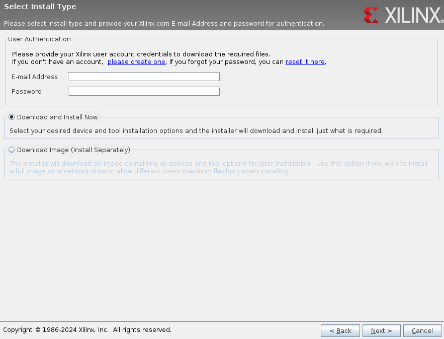
</p>


In the select product window, select *Vivado* and proceed.
<p align="center">
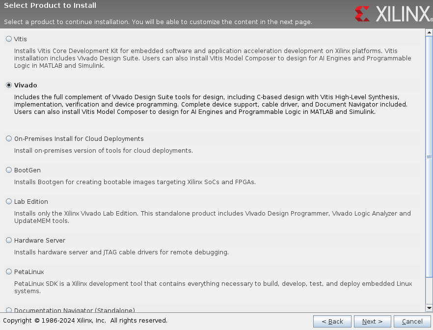
</p>

Select Vivado ML Standard edition as it does not require a license to generate the necessary file to program the [Zybo-Z7](https://digilent.com/reference/programmable-logic/zybo-z7/start) development.

<p align="center">
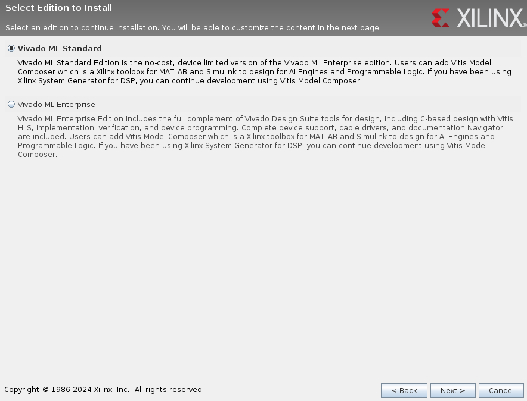
</p>


The two versions of Zybo-Z7, Z7-10, and Z7-20 include [Zynq-7000 SoC](https://www.amd.com/en/products/adaptive-socs-and-fpgas/soc/zynq-7000.html) XC7Z010 and XC7Z020 devices respectively. From [UG973](https://www.xilinx.com/support/documents/sw_manuals/xilinx2022_2/ug973-vivado-release-notes-install-license.pdf) table 1, Vivado ML Standard Edition includes the license for the required FPGA.


Installing only the [Zynq-7000 SoC](https://www.amd.com/en/products/adaptive-socs-and-fpgas/soc/zynq-7000.html) will require less storage space as it can be seen in the figure below.

<p align="center">
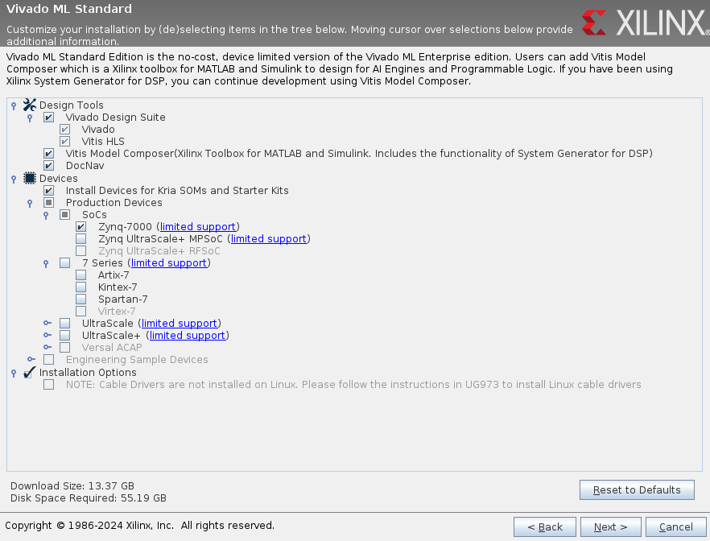
</p>


Agree to all the terms and conditions and process further.

<p align="center">

</p>


The installing directory should be */tools/Xilinx*, there are errors in the image shown below because Vivado is already installed in the specified location. If it is a fresh installation then these errors will not be displayed.

<p align="center">
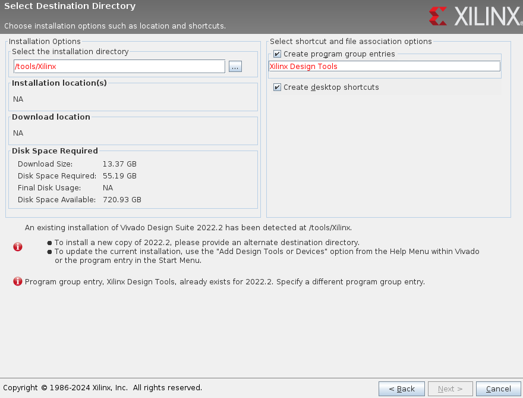
</p>

The final step is to click on the install button on the summary window. Here the installation location should specify the selected installation location by the user.

<p align="center">
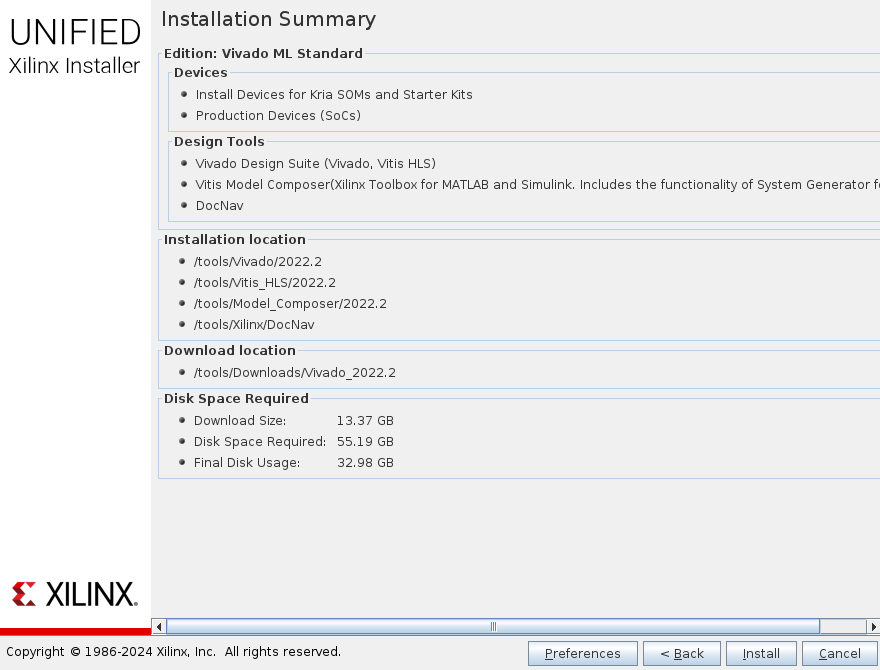
</p>

## Install Cable Drivers

Once the installation is completed, check if the cable drivers are installed correctly using the following command:

```
ls -la /etc/udev/rules.d
```
This should output the following two files:
- 52-digilent-usb.rules
- 52-xilinx-pcusb.rules

If the above files are not present, run the installer file *install_drivers* from the following directory:

<YOUR_XILINX_INSTALL>/data/xicom/cable_drivers/<lin64 or lin32>/install_scripts/install_drivers

Example:
```
/tools/Xilinx/Vivado/2022.2/data/xicom/cable_drivers/lin64/install_script/install_drivers
```
To reinstall the FTDI drivers, execute the *setup_xilinx_ftdi* file.

## Launch Vivado

Add the following code to the *~/.profile* to launch vivado from terminal.

```
source /tools/Xilinx/Vivado/2022.2/setting64.sh
```

Execute *Vivado* command from termial to open Vivado gui.

# Digilent Zybo-Z7

The Zynq-7000 series is a family of System on Chips (SoCs) from Xilinx, combining a processing system (PS) and programmable logic (PL) on a single device. These SoCs are designed to provide the flexibility of an FPGA with the processing power of an ARM Cortex-A9 CPU.

Key Features:

Processing System (PS):
- Dual-Core ARM Cortex-A9 CPU: Operating up to 1 GHz, providing high-performance processing power.
- Memory Interfaces: Supports DDR3, DDR3L, DDR2, and LPDDR2 memory.
- Integrated Peripherals: Includes USB, Ethernet, SD/SDIO, UART, SPI, I2C, and CAN interfaces.

Programmable Logic (PL):
- FPGA Fabric: Ranges from 28K to 444K logic cells, offering extensive flexibility for custom hardware designs.
- DSP Slices: High-performance DSP slices for signal processing applications.
- Block RAM: Embedded memory blocks for efficient data storage and access.
- Clock Management: Multiple clock management tiles (CMTs) for clock generation and distribution.

High Bandwidth Connectivity:
- High-speed serial transceivers for gigabit interfaces.
- AXI interconnect for seamless communication between PS and PL.

Development Tools:
- Vivado Design Suite: Integrated design environment for hardware and software co-design.
- SDK (Software Development Kit): Comprehensive tools for software development and debugging.


<p align="center">
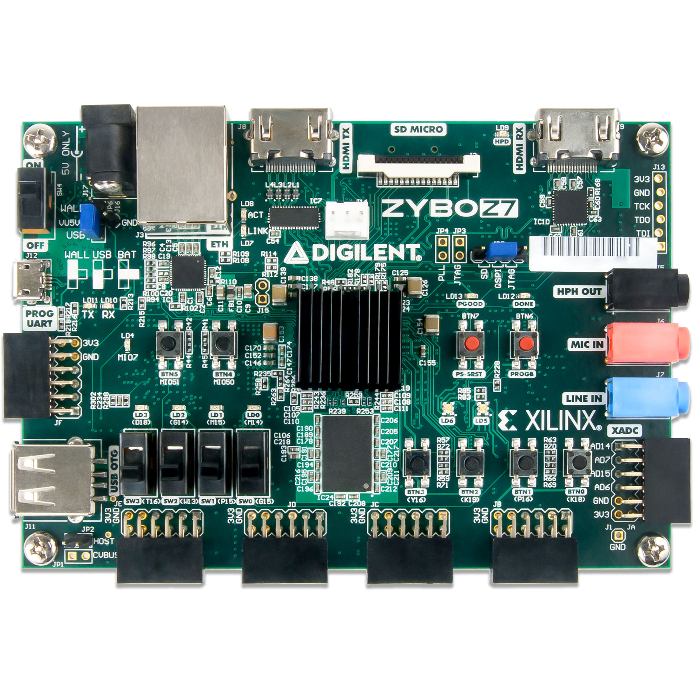
</p>

- [Zynq DataSheet](https://docs.amd.com/v/u/en-US/ds187-XC7Z010-XC7Z020-Data-Sheet)
- [Zybo Reference Manual](https://digilent.com/reference/_media/reference/programmable-logic/zybo-z7/zybo-z7_rm.pdf)

# TM1638: Peripherals

The TM1638 is an integrated circuit designed by Titan Microelectronics that is commonly used for controlling LED displays and reading keypad inputs. It is particularly popular in DIY electronics projects and hobbyist applications due to its simplicity and versatility.


<p align="center">
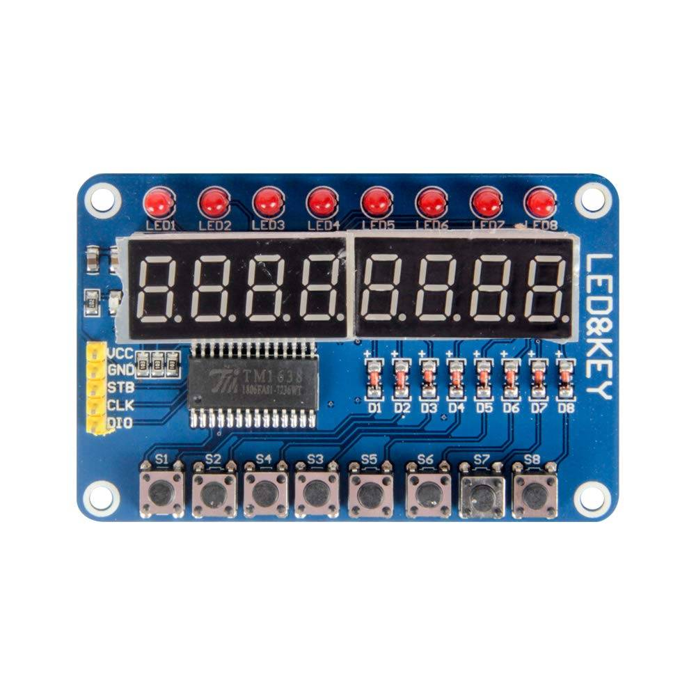
</p>

Many design examples in

### PMOD Port

PMOD, short for Peripheral Module, is a standardized connector and interface used for connecting peripheral devices to FPGA and microcontroller development boards. Developed by Digilent, PMOD modules provide an easy and flexible way to add functionality to development systems without the need for complex wiring or additional circuitry.

<p align="center">
  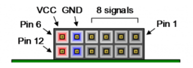
</p>

### PMOD Connection

The figure shows PMOD JE pin names along with the pin label. The TM1638 is connected to the PMOD JE of the development board.


<p align="center">
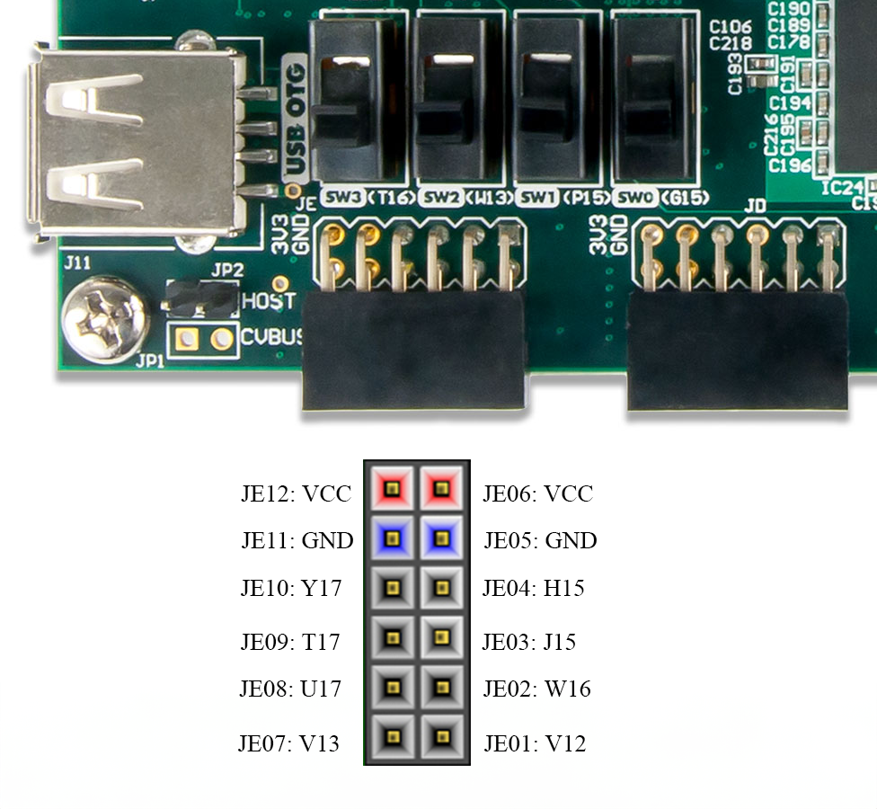
</p>


### Connecting Wire

Female-to-male connector wires, also known as jumper wires, are commonly used in electronics prototyping and development to connect components on breadboards, development board pins. These wires come with a female connector on one end and a male connector on the other.

<p align="center">
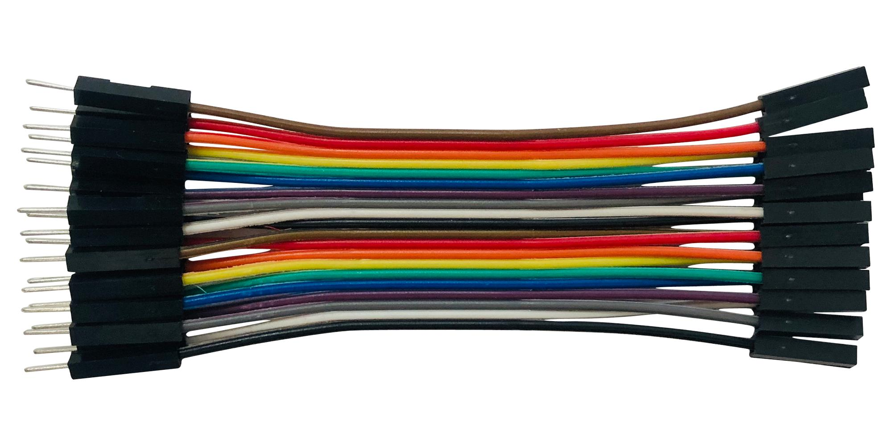
</p>


## Hardware Setup

<p align="center">
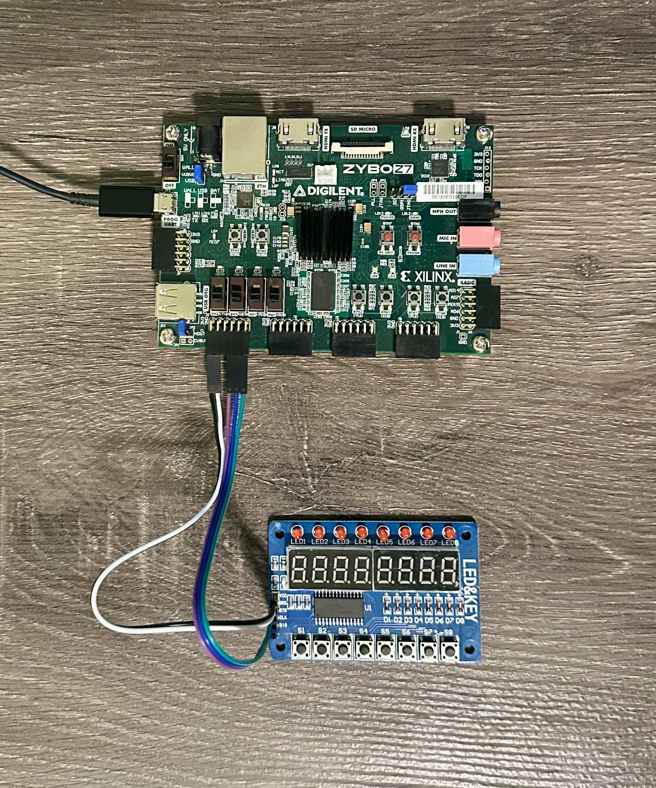
</p>

## Git

Git is a distributed version control system used to track changes in source code during software development.

[Git Cheat Sheet](https://github.com/yuri-panchul/basics-graphics-music/blob/main/git_cheat_sheet.md) provides some basic commands to get started with git.

### Install Git

Execute the following command to install git

```
sudo apt install git
```
To check whether git is installed correctly, exeute the following command:

```
git --version
```

If git is installed, it will provide the git version.

### Clone the Project Repo

[Basic-Graphics-Music](https://github.com/yuri-panchul/basics-graphics-music/tree/main) provides the necessary execises to learn the basics of digital design to begin with. As you advance through the lab exercises, basic display interface for the FPGA includes leds,7-segment disaply and LCD display. The FPGA development includes audio connector that can process analogue signals. These catogories comprises of the lab. Hence, the name Basics-Graphics-Music.

## Implementing The Design on Zybo-Z7

To understand the process to implement any design on the FPGA, let's learn the process with an example of a simple binary counter.

1. First, you need to configure the board by the bas scrip *Check_set_and_choose_fpga_board.bash* in basics-graphics-music folder. This will display a number of availabe boards that be used with the design exercises. Type "62" as that corresponds to the Zybo-Z7 and hit enter.

<p align="center">
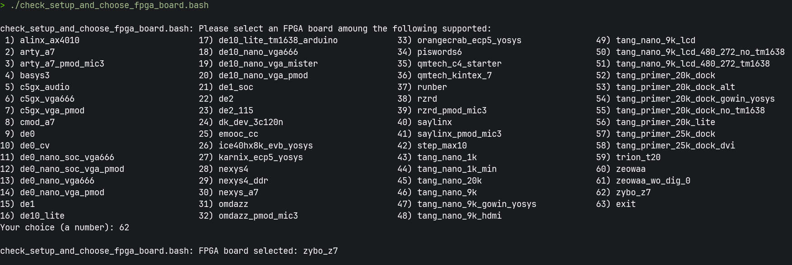
</p>


2. Navigate to the desired directory by using the *cd* command followed by the path to the location.

    ```
    cd basics-graphics-music/labs/1_basics/1_06_binary_counter
    ```
3. Run the script *03_synthesize_for_fpga.bash* to generate the bit stream for the Zybo-Z7.

    NOTE: TURN ON THE BOARD BEFORE RUNNING THE SCRIPT.

4. Once the bit stream generation is complete, the Vivado tool will open hardware target and program the board. After completion it will close the target.

<p align="center">
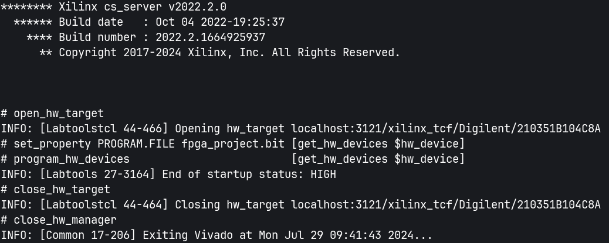
</p>


   When you see these instruction in the log the board should be working as shown in demo video. The demo shows the output of the binary counter.

<p align="center">

</p>

NOTE: THE DIP SWITCH (SW3) ON THE BOARD MUST BE SET LOW TO SEE THE OUTPUT ON THE TM1638 BOARD.