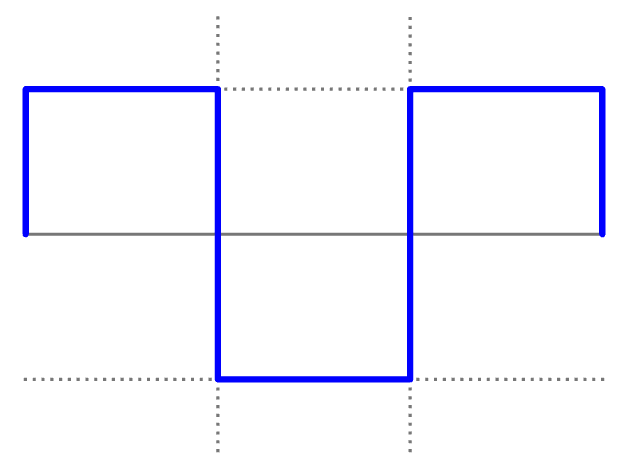
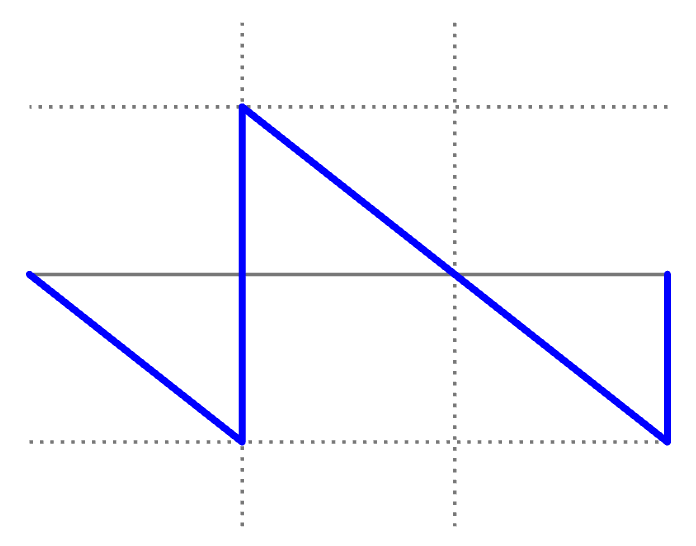
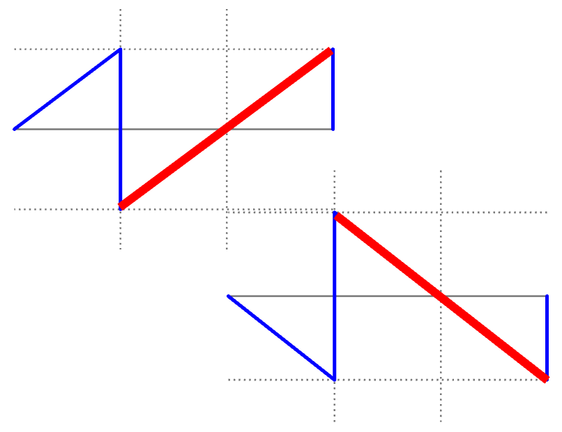
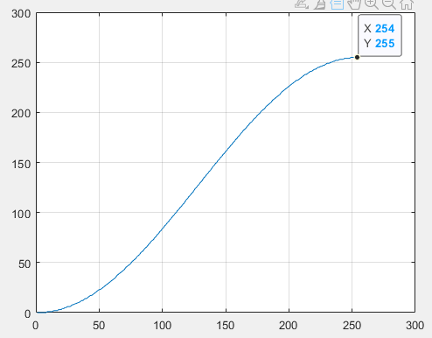

[Назад в оглавление](../../README.md)

# Генераторы звука

Данный пример содержит в себе несколько генераторов звука, переключение между которыми возможно с помощью переключателей на плате. Проигрывается частота 440 герц (нота ля первой октавы).

# Генератор меандра



Генератор меандра находится в файле `audio_square.sv`

## Описание примера

Генератор меандра состоит из следующих частей:
- Счетчик частоты
- Счетчик меандра

### Счётчик частоты

Счётчик частоты используется во всех представленных на данном занятии модулях, поэтому будет разобран тут и далее ему внимание уделяться не будет.

```verilog
  // Frequency counter
  localparam FREQ_CNT_WIDTH = 19;

  logic [FREQ_CNT_WIDTH-1:0] freq_counter_ff;
  logic [FREQ_CNT_WIDTH-1:0] freq_counter_next;

  assign freq_counter_next = freq_counter_ff + freq_i;

  always_ff @(posedge clk_i or posedge rst_i) begin
    if (rst_i)
      freq_counter_ff <= '0;
    else
      freq_counter_ff <= freq_counter_next;
  end

  logic freq_msb_dly_ff;

  always_ff @(posedge clk_i or posedge rst_i) begin
    if (rst_i)
      freq_msb_dly_ff <= '0;
    else
      freq_msb_dly_ff <= freq_counter_ff[FREQ_CNT_WIDTH-1];
  end

  logic freq_ofl;
  assign freq_ofl = ~freq_counter_ff[FREQ_CNT_WIDTH-1] & freq_msb_dly_ff;
```

Суть этого счётчика заключается в следующем:
- Каждый такт мы прибавляем к регистру `freq_counter_ff` значение из входного порта `freq_i`
- В какой-то момент счётчик переполнится, и мы отслеживаем этот момент (сигнал `freq_ofl`)
- `freq_ofl` используется далее в качестве enable для всей логики, генерирующей звуковые сигналы
- Таким образом, чем выше значение `freq_i`, тем быстрее нарастает значение `freq_counter_ff` и быстрее этот регистр переполняется. Чем быстрее переполняется регистр, тем чаще генерируется новое состояние звукового сигнала
- Итог: `freq_i` позволяет управлять частотой генерируемого звука

### Счётчик меандра

```verilog
  // Square signal generation
  logic [7:0] square_ff;

  always_ff @(posedge clk_i or posedge rst_i) begin
    if (rst_i)
      square_ff <= '0;
    else if (freq_ofl)
      square_ff <= square_ff + 1;
  end

  // Square counter MSB is used as actual output
  assign sample_data_o = {8{square_ff[7]}};
```

Счётчик меандра представляет из себя обычный 8-бит счетчик, при этом в качестве выхода меандра используется только его старший бит. Такое несколько странное решение сделано с целью добиться одинакового соотношения `freq_i` к реальной частоте звука во всех генераторах.
Значение `freq_i` для требуемой частоты звука F вычисляется по следующей формуле:

```
freq_i=round((2^27*F)/(f_mhz * 1000000))-1
```

# Генератор сигнала пилообразной формы


Генератор сигнала пилообразной формы находится в файле `audio_saw.sv`

## Описание примера

Генератор сигнала пилообразной формы отличается от генератора меандра только тем, что регистр (счётчик меандра) заведён на звуковой выход полностью, а не только в виде старшего бита.
```verilog
  // Saw signal generation
  logic [7:0] saw_ff;

  always_ff @(posedge clk_i or posedge rst_i) begin
    if (rst_i)
      saw_ff <= '0;
    else if (freq_ofl)
      saw_ff <= saw_ff + 1;
  end

  assign sample_data_o = saw_ff;
```


# Генератор сигнала обратной пилообразной формы


Генератор сигнала обратной пилообразной формы находится в файле `audio_saw_inv.sv`

## Описание примера

Генератор сигнала обратной пилообразной формы отличается от генератора пилы только отрицательным направлением счёта регистра `saw_inv_ff`.

```verilog
  // Saw signal generation
  logic [7:0] saw_inv_ff;

  always_ff @(posedge clk_i or posedge rst_i) begin
    if (rst_i)
      saw_inv_ff <= '1;
    else if (freq_ofl)
      saw_inv_ff <= saw_inv_ff - 1;
  end

  assign sample_data_o = saw_inv_ff;
```


# Генератор сигнала треугольной формы




Генератор сигнала треугольной формы находится в файле `audio_triangle.sv`

## Описание примера

Данный генератор содержит в себе логику пилы и обратной пилы, а также регистр `saw_select_ff`, управляющий переключением между двумя пилами.

```verilog
  logic [7:0] saw_ff;

  always_ff @(posedge clk_i or posedge rst_i) begin
    if (rst_i)
      saw_ff <= '0;
    else if (freq_ofl)
      saw_ff <= saw_ff + 1;
  end
```


```verilog
  logic [7:0] saw_inv_ff;

  always_ff @(posedge clk_i or posedge rst_i) begin
    if (rst_i)
      saw_inv_ff <= '1;
    else if (freq_ofl)
      saw_inv_ff <= saw_inv_ff - 1;
  end
```

```verilog
  logic saw_select_ff;
  logic saw_select_en;

  assign saw_select_en = freq_ofl & (saw_ff == 8'hff);


  always_ff @(posedge clk_i or posedge rst_i) begin
    if (rst_i)
      saw_select_ff <= '0;
    else if (saw_select_en)
      saw_select_ff <= ~saw_select_ff;
  end


  assign sample_data_o = saw_select_ff ? saw_inv_ff
                                       : saw_ff;
```

Таким образом, для формирования треугольника мы используем нарастающую часть обычный пилы и нисходящую часть обратной пилы.
Важно отметить, что длина сигнала треугольной формы при таком подходе получается равной 512 отчетам. Для того, чтобы частота совпадала с другими генераторами, нам необходимо с помощью сдвига влево умножить значение `freq_i` на два.

```verilog
  assign freq_counter_next = freq_counter_ff + (freq_i << 1); // As triangle takes 512 samples, we multiply frequency by 2
```

# Генератор сигнала синусоидальной формы


Генератор сигнала синусоидальной формы находится в файле `audio_sine.sv`


## Описание примера

Представленный генератор сигнала синусоидальной формы построен на табличном синусе и использует одну хитрость. Синус обладает симметрией, поэтому мы можем хранить только половину таблицы синуса и использовать нарастающую, а затем убывающую индексацию такой половинной таблицы.

При этом для хранения таблицы синуса мы используем модуль `sine_table.sv`, хранящий таблицу синуса.

Графическое представление табличного синуса представлено на изображении.



К счастью, у нас уже есть модуль, который способен сгенерировать возрастающую и затем убывающую индексацию – генератор треугольного сигнала. Его логику мы и используем, подключая выход генератора треугольного сигнала как индекс таблицы синуса.

```verilog
  logic [7:0] triangle;
  assign triangle = saw_select_ff ? saw_inv_ff
                                  : saw_ff;

  assign sample_data_o = sine_table[triangle];
```


# Генератор псевдослучайного шума

Генератор псевдослучайного шума находится в файле `audio_noise.sv`


## Описание примера

Генератор псевдослучайного шума построен по принципу сдвигового регистра с линейной обратной связью.

Регистр `noise_shiftreg_ff` на каждом шаге сдвигается на один бит влево, при этом с правой стороны в него задвигается результат XOR между 22 и 17 битами этого же регистра `(noise_shiftreg_ff[22] ^ noise_shiftreg_ff[17])`.

```verilog
  logic [22:0] noise_shiftreg_ff;
  logic [22:0] noise_shiftreg_next;
  logic [7:0] noise_output;

  localparam NOISE_SHREG_INIT = 22'h7FFFF8;

  // Shift register left
  // LSB is (bit22 ^ bit17)
  assign noise_shiftreg_next = {noise_shiftreg_ff[21:0],
                               (noise_shiftreg_ff[22] ^ noise_shiftreg_ff[17])};

  always_ff @(posedge clk_i or posedge rst_i) begin
    if (rst_i)
      noise_shiftreg_ff <= NOISE_SHREG_INIT;
    else if (freq_ofl)
      noise_shiftreg_ff <= noise_shiftreg_next;
  end
```

Далее на выход блока данные подаются в немного перетасованной форме:
```verilog
  // Select specific shift register bits for 8-bit output
  assign noise_output = {noise_shiftreg_ff[22],
                         noise_shiftreg_ff[20],
                         noise_shiftreg_ff[16],
                         noise_shiftreg_ff[13],
                         noise_shiftreg_ff[11],
                         noise_shiftreg_ff[7],
                         noise_shiftreg_ff[4],
                         noise_shiftreg_ff[2]};
```

Сочетание циклического сдвига с XOR и перетасовки данных на выходе обеспечивает генерацию сигнала, очень похожего на случайный. Такой сигнал наши уши воспринимают как шум.

Для программистов алгоритм работы генератора можно описать следующим листингом на языке Си:

```c
/* Test a bit. Returns 1 if bit is set. */
long bit(long val, byte bitnr) {
  return (val & (1<<bitnr))? 1:0;
}


/* Generate output from noise-waveform */
void Noisewaveform {
  long bit22;	/* Temp. to keep bit 22 */
  long bit17;	/* Temp. to keep bit 17 */

  long reg= 0x7ffff8; /* Initial value of internal register*/

  /* Repeat forever */
  for (;;;) {

    /* Pick out bits to make output value */
    output = (bit(reg,22) << 7) |
         (bit(reg,20) << 6) |
         (bit(reg,16) << 5) |
         (bit(reg,13) << 4) |
         (bit(reg,11) << 3) |
         (bit(reg, 7) << 2) |
         (bit(reg, 4) << 1) |
         (bit(reg, 2) << 0);

    /* Save bits used to feed bit 0 */
    bit22= bit(reg,22);
    bit17= bit(reg,17);

    /* Shift 1 bit left */
    reg= reg << 1;

    /(* Feed bit 0 */
    reg= reg | (bit22 ^ bit17);
  };
};
```

> Интересный факт заключается в том, что представленный генератор шума является полной копией генератора шума из микросхемы SID, структура генератора была получена в результате реверс-инжиниринга (http://www.sidmusic.org/sid/sidtech5.html).

Также стоит отметить неочевидный момент: выдаваемый генератором шума звук меняется при изменении частоты `freq_i`, так как меняется спектр шума.
