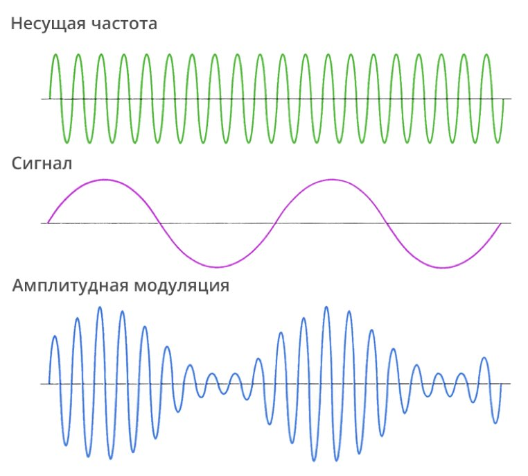

[Назад в оглавление](../../README.md)

# Амплитудная модуляция

Демонстрация амплитудной модуляции находится в файле `mod_amplitude.sv`.

## Описание примера

В показанном примере громкость генератора синусоидального сигнала модулируется выходом из генератора сигнала треугольной формы.



Генератор сигнала треугольной формы подключен так, что на его вход подаётся значение `freq_i`, сдвинутое на 7 бит вправо. Не нужно искать в этом значении математическое обоснование или глубокий смысл -- оно подобрано эмпирически для достижения интересного звукового эффекта.

```verilog
  logic [15:0] ampl_mod_freq;
  assign ampl_mod_freq = freq_i >> 7;

  audio_triangle i_ampl_mod(
    .clk_i         (clk_i),
    .rst_i         (rst_i),
    .freq_i        (ampl_mod_freq),
    .sample_data_o (amplitude)
  );
```

Непосредственно амплитудная модуляция выполняется перемножением выхода канала синусоиды на выход канала треугольной волны. Используются старшие 8 бит результата умножения.

```verilog
  logic [15:0] ampl_modulated_sample;

  assign ampl_modulated_sample = (amplitude * sample_data);

  assign sample_data_o = ampl_modulated_sample >> 8;
```
