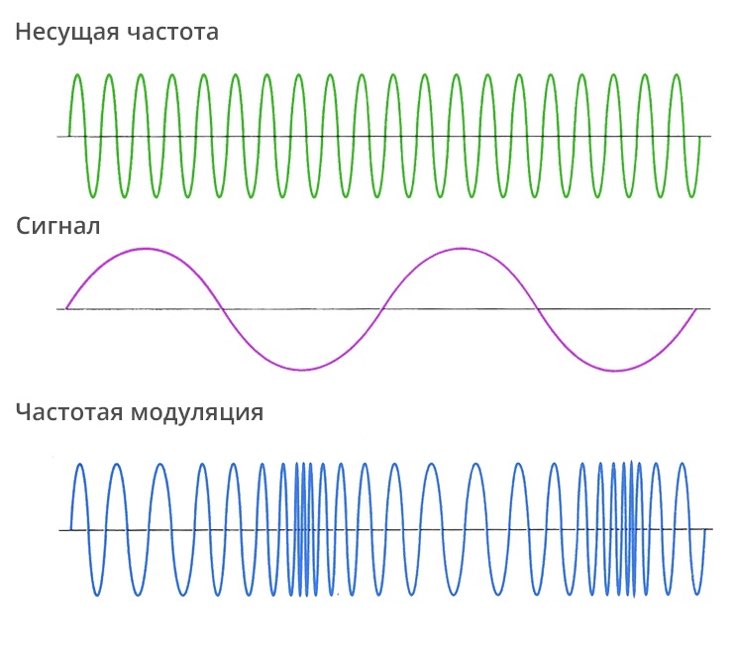

[Назад в оглавление](../../README.md)

# Частотная модуляция

Демонстрация частотной модуляции находится в файле `mod_frequency.sv`.





В показанном примере частота генератора синусоидального сигнала модулируется выходом из генератора сигнала треугольной формы.

Генератор сигнала треугольной формы подключен так, что на его вход подаётся значение `freq_i`, сдвинутое на 7 бит вправо. Не нужно искать в этом значении математическое обоснование или глубокий смысл -- оно подобрано эмпирически для достижения интересного звукового эффекта.

```verilog
  logic [15:0] modulation_freq;
  assign modulation_freq = freq_i >> 7;

  audio_triangle i_freq_mod(
    .clk_i         (clk_i),
    .rst_i         (rst_i),
    .freq_i        (modulation_freq),
    .sample_data_o (modulation_data)
  );
```

На вход частоты синусоиды треугольная волна подаётся с увеличенным размахом и со смещением на 1000 вверх. Как и ранее, эти числа были подобраны эмпирически для красивого звука.

```verilog
  logic [15:0] carrier_freq;

  assign carrier_freq = 1000 + (modulation_data << 4);

  audio_sine i_carrier(
    .clk_i         (clk_i),
    .rst_i         (rst_i),
    .freq_i        (carrier_freq),
    .sample_data_o (sample_data)
  );


  assign sample_data_o = sample_data;
```
