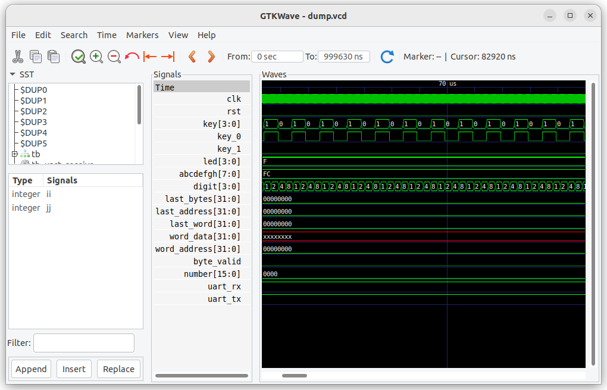
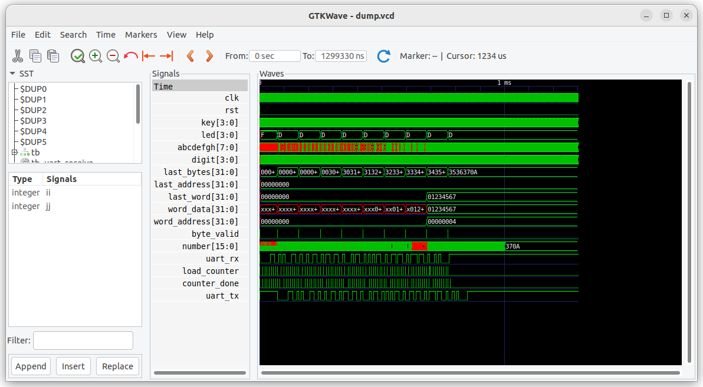

Lab UART - Guide to Implementation

## Purpose of the work

* Introduction to serial protocol
* Simulation in icarus verilog and gtkwave
* Building the project and running it on a debug board

## Hardware requirements

* debug board from the list of supported
* connecting the debug board to the computer via a serial port
* program for working with the serial port (Minicom, Putty, etc.)

## Execution order

1. Open a terminal in the 8_1_uart directory. This can be the built-in Visual Studio Code terminal or a separate terminal
2. Run the script ./12_prepare_step_1.bash - this will copy files from the support/step_1 directory to the current directory
3. Browse the project files:
* tb.sv - top level for simulation
* tb_pkg.svh - test functions
* lab_top.sv - component for synthesis, inserted into the top-level component for a specific debug board
* uart_receiver.sv - data reception
* uart_transmitter.sv - data transmission
* hex_parser.sv - data decoding
4. Run the project simulation: ./10_simulate_rtl_icarus.bash

The console should display the following output:

```
test_id=          0  name: test_uart  
test_seq_key0() - start
test_seq_key0() - complete


test_id=0     test_name:       test_uart         TEST_FAILED *******
```

5. Find task test_seq_key0() in tb_pkg.svh
6. Find test_seq_key0 call in tb.sv
7. Run GTKWave program - to run it you need to use ./11_simulate_rtl_gkr_wave.bash script. It is possible that the program will not run from the built-in Visual Studio Code terminal, in this case you need to use an external terminal. Change the display scale to see changes in the key_0 signal.

GTKWave program view:


    Test questions:

        7.1 Where are the signals key[0], key[1], key_0, key_1 generated?
        7.2 Where is the initial value of the uart_rx signal generated?
        7.3 Where is the signal number generated?

The console should display the following output:

```    
test_id=          0  name: test_uart  
test_seq_key1() - start
test_seq_key0() - start
test_seq_key0() - complete
test_seq_key1() - complete


test_id=0     test_name:       test_uart         TEST_FAILED *******
```

10. Update the data in the GTKWave program (you need to click on the Reload button)
GTKWave program view:


    Test questions:

        10.1. How has the formation of the signals key[1], key_1 changed?
        10.2. Why are there undefined values ​​for the signal number?

The console should display the following output:

```
test_id=          0  name: test_uart  
test_seq_uart_p0() - start
test_seq_key1() - start
test_seq_key0() - start
test_seq_uart_p0() - complete
test_seq_key0() - complete
test_seq_key1() - complete


test_id=0     test_name:       test_uart         TEST_FAILED *******    
```

13. Update the data in the GTKWave program (you need to click on the Reload button)
GTKWave program view:


    Test questions:

        13.1. How has the formation of the uart_rx signal changed?
        13.2. Where is the uart_rx signal formed?

        13.2. What value did the last_bytes signal take at the end of the test execution?
        13.3. Where is the start bit located in the serial protocol?
        13.4. Where are the data bits located in the serial protocol?
        13.5. Where is the stop bit located in the serial protocol?

15. In task test_seq_uart_p0() uncomment the call tb_uart_send( 8'h01 );
16. Run the simulation: ./10_simulate_rtl_icarus.bash
17. Update the data in the GTKWave program (you need to click the Reload button)
GTKWave program view:


    Test questions:

        17.1. How was the uart_rx signal generated?
        17.2. How did the last_bytes signal change during the test?

18. In task test_seq_uart_p0() uncomment the transfer of the remaining bytes, you can set your own values ​​for the bytes to be transferred. Run the simulation and see the result of transferring four bytes.

19. In the tb.sv file, comment out the test_seq_uart_p0() call, uncomment the test_seq_uart_p1() call and the test_passed signal generation condition (the line "&& 1==test_uart_p2" should remain commented out)

20. Run the simulation: ./10_simulate_rtl_icarus.bash

The console should display the following output:        


```
test_id=          0  name: test_uart  
test_seq_uart_p1() - start
test_seq_key1() - start
test_seq_key0() - start
last_bytes: 3536370a - Ok
word_address: 00000004 - Ok
word_data: 01234567 - Ok
test_seq_uart_p1() - complete
test_seq_key0() - complete
test_seq_key1() - complete


test_id=0     test_name:       test_uart         TEST_PASSED
```

21. Update the data in the GTKWave program (you need to click on the Reload button)
GTKWave program view:

    Test questions:

        21.1. What conditions are used to decide whether the test was executed correctly?
        21.2. What values ​​did the word_data, word_address signals take?
        21.3. Why did the word_address signal value change?

    Note: at this point, the project files should match the files in the support/step_2 directory

22. Build the project for the selected debug board

* To select the debug board, use the check_setup_and_choose_fpga_board.bash script in the root directory of the repository
* To build the project, use the 03_synthesize_for_fpga.bash script
* The project will be built and loaded onto the debug board

Depending on the type of seven-segment indicator on the board and the presence of switches, the results may vary.

Check how quickly the numbers on the seven-segment indicator change.

23. In the lb_top.sv file, change the update_hz constant to increase the refresh rate of the seven-segment display

24. Build the project and upload the project to the board

25. Open a terminal on your computer and connect it to the selected port.
Make sure that the correct parameters are set:
* baud rate: 115200 bps
* number of bits: 8
* no parity
* number of stop bits: 1
* hardware flow rate control disabled

Launch the terminal: ./13_run_serial_terminal.bash

For Windows, the Putty program will be launched. At the first launch, you need to configure: [putty_setup_rus.md](./putty_setup_rus.md)

For Linux-based systems, the minicom program will be launched, the program configuration procedure is given here: [minicom_setup_rus](./minicom_setup_rus.md)

It is possible to use other programs to work with the serial port.

26. Enter the characters 1 2 3 4 in the serial port terminal

    Test questions: 

        26.1. What values ​​are displayed on the seven-segment indicator?
        26.2. How do the values ​​on the seven-segment indicator change depending on the switch positions?
        26.3. Why are the entered characters not visible in the serial port terminal?

27. Set the switches to the position that displays the word_addres signal
28. Enter numbers in the terminal, watch how the address changes. You should see that word_address increases by 1 when entering eight digits and resets to 0 if the number entry stops.

29. In the tb.sv file, uncomment the call to test_seq_uart_p2() and the line "&& 1==test_uart_p2"

30. Run the simulation: ./10_simulate_rtl_icarus.bash

The console should display the following output:

```
test_id=          0  name: test_uart  
test_seq_uart_p2() - start
test_seq_uart_p1() - start
test_seq_key1() - start
test_seq_key0() - start
tb_receive:  0 00 expect: 30 - ERROR
tb_receive:  1 00 expect: 31 - ERROR
tb_receive:  2 00 expect: 32 - ERROR
tb_receive:  3 00 expect: 33 - ERROR
tb_receive:  4 00 expect: 34 - ERROR
tb_receive:  5 00 expect: 35 - ERROR
tb_receive:  6 00 expect: 36 - ERROR
tb_receive:  7 00 expect: 37 - ERROR
tb_receive:  8 00 expect: 0a - ERROR
test_seq_uart_p2() - complete
last_bytes: 3536370a - Ok
word_address: 00000004 - Ok
word_data: 01234567 - Ok
test_seq_uart_p1() - complete
test_seq_key0() - complete
test_seq_key1() - complete


test_id=0     test_name:       test_uart         TEST_FAILED *******
```

31. In the lab_top.sv file, uncomment the uart_transmitter component.
30. Run the simulation: ./10_simulate_rtl_icarus.bash

The console should display the following output:

```
test_id=          0  name: test_uart  
test_seq_uart_p2() - start
test_seq_uart_p1() - start
test_seq_key1() - start
test_seq_key0() - start
last_bytes: 3536370a - Ok
word_address: 00000004 - Ok
word_data: 01234567 - Ok
test_seq_uart_p1() - complete
tb_receive:  0 30 - Ok
tb_receive:  1 31 - Ok
tb_receive:  2 32 - Ok
tb_receive:  3 33 - Ok
tb_receive:  4 34 - Ok
tb_receive:  5 35 - Ok
tb_receive:  6 36 - Ok
tb_receive:  7 37 - Ok
tb_receive:  8 0a - Ok
test_seq_uart_p2() - complete
test_seq_key0() - complete
test_seq_key1() - complete


test_id=0     test_name:       test_uart         TEST_PASSED
```

31. Update the data in the GTKWave program (you need to click the Reload button)
GTKWave program view:


    Test questions:

        31.1. Why is the uart_tx signal delayed relative to the uart_rx signal?

32. Build the project for the selected debug board

33. Type the characters 1 2 3 4 in the serial port terminal

The serial port terminal should display the characters you type.

Experiment with different switch positions.        

## Conclusion

A typical iterative development process is shown during the lab work.

The composition of one iteration:

1. Changing the source code of the project
2. Modeling
3. Analysis of results

A test project is used that produces a binary response: "TEST PASSED" or "TEST_FAILED"

The transition to debugging on the hardware is performed only after the successful execution of the test on the simulator.