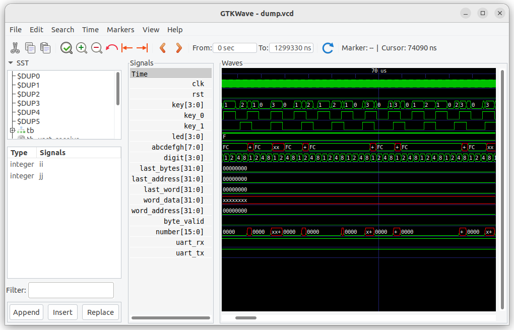
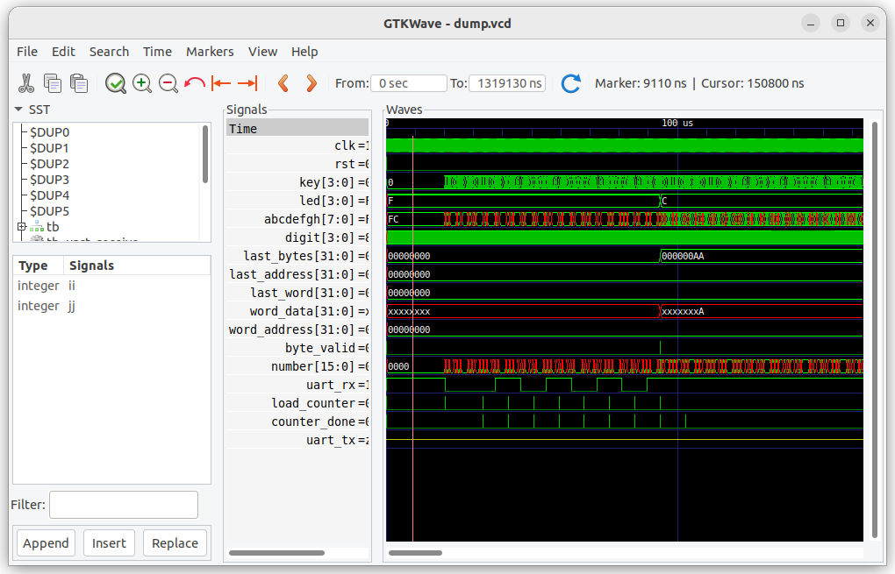
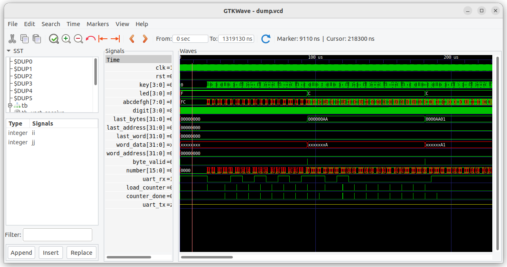
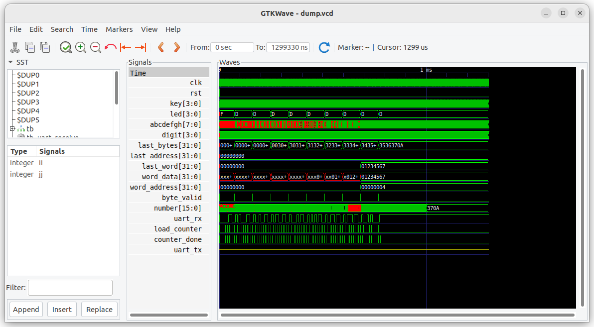

# Лабораторная работа UART - руководство по выполнению

## Цель работы

* Знакомство с последовательным протоколом  
* Моделирование в системе icarus verilog и gtkwave
* Сборка проекта и запуск на отладочной плате

## Требования к оборудованию

* отладочная плата из списка поддерживаемых
* подключение отладочной платы к компьтеру через последовательный порт
* программа для работы с последовательным портом (Minicom, Putty и т.д.)

## Порядок выполнения

1. Откройте терминал в каталоге 8_1_uart. Это может быть встроенный терминал Visual Studio Code или отдельный терминал
2. Выполните скрипт ./12_prepare_step_1.bash  - будут скопированы файлы из каталога support/step_1 в текущий каталог
3. Выполните обзор файлов проекта:
    * tb.sv - верхний уровень для моделирования
    * tb_pkg.svh - функции тестирования
    * lab_top.sv - компонент для синтеза, вставляется в компонент верхнего уровня для конкретной отладочной платы
    * uart_receiver.sv - приём данных 
    * uart_transmitter.sv - передача данных
    * hex_parser.sv - декодирование данных
4. Запустите моделирование проекта: ./10_simulate_rtl_icarus.bash

В консоли должен быть вывод:

```
test_id=          0  name: test_uart  
test_seq_key0() - start
test_seq_key0() - complete


test_id=0     test_name:       test_uart         TEST_FAILED *******
```

5. Найдите task test_seq_key0() в файле tb_pkg.svh
6. Найдите вызов  test_seq_key0 в файле tb.sv
7. Запустите программу GTKWave - для запуска надо использовать скрипт ./11_simulate_rtl_gkr_wave.bash. 
    Возможно что из втроенного терминала Visual Studio Code программа не запустится, в этом случае надо использовать внешний терминал.
    Измените масштаб отображения что бы увидеть изменения сигнала key_0
    Вид программы GTKWave:


    Контрольные вопросы:

        7.1 Где формируется сигналы key[0], key[1], key_0, key_1 ?
        7.2 Где формируется начальное значение сигнала uart_rx ? 
        7.3 Где формируется сигнал number ?

8. В файле tb.sv раскомментируйте вызов test_seq_key1()
9. Выполните моделирование: ./10_simulate_rtl_icarus.bash

В консоли должен быть вывод:

```    
test_id=          0  name: test_uart  
test_seq_key1() - start
test_seq_key0() - start
test_seq_key0() - complete
test_seq_key1() - complete


test_id=0     test_name:       test_uart         TEST_FAILED *******
```
10. Обновите данные в программе GTKWave (надо нажать на кнопке Reload)
    Вид программы GTKWave:


    Контрольные вопросы:

        10.1. Как изменилось формирование сигналов key[1], key_1 ?
        10.2. Почему есть неопределённые значения сигнала number ?

11. В файле tb.sv раскомментируйте вызов test_seq_uart_p0()
12. Выполните моделирование: ./10_simulate_rtl_icarus.bash

В консоли должен быть вывод:

```
test_id=          0  name: test_uart  
test_seq_uart_p0() - start
test_seq_key1() - start
test_seq_key0() - start
test_seq_uart_p0() - complete
test_seq_key0() - complete
test_seq_key1() - complete


test_id=0     test_name:       test_uart         TEST_FAILED *******    
```

13. Обновите данные в программе GTKWave (надо нажать на кнопке Reload)
    Вид программы GTKWave:


    Контрольные вопросы:

        13.1. Как изменилось формирование сигнала uart_rx ?
        13.2. Где формируется сигнал uart_rx ? 
        13.2  Какое значение принял сигнал last_bytes в конце выполнения теста ?
        13.3  Где расположен стартовый бит в последовательном протоколе ?
        13.4  Где расположены биты данных в последовательном протоколе ?
        13.5  Где расположет стоповый бит в последовательном протоколе ?

15. В task test_seq_uart_p0() раскомментируйте вызов tb_uart_send( 8'h01 );
16. Выполните моделирование: ./10_simulate_rtl_icarus.bash
17. Обновите данные в программе GTKWave (надо нажать на кнопке Reload)
    Вид программы GTKWave:


    Контрольные вопросы:

        17.1. Как именилось формирование сигнала uart_rx ?
        17.2  Как изменялся сигнал last_bytes в ходе выполнения теста ?


18. В task test_seq_uart_p0() раскомментируйте передачу остальных байт, можете задать свои значения для передаваемых байт. Выполните моделирование и посмотрите результат передачи четырёх байт.

19. В файле tb.sv закомментируйте вызов test_seq_uart_p0(), раскомментируйте вызов test_seq_uart_p1() и условие формирования сигнала test_passed (строка "&& 1==test_uart_p2" должна остаться закомментированной)

20. Выполните моделирование: ./10_simulate_rtl_icarus.bash

В консоли должен быть вывод:

```
test_id=          0  name: test_uart  
test_seq_uart_p1() - start
test_seq_key1() - start
test_seq_key0() - start
last_bytes: 3536370a - Ok
word_address: 00000004 - Ok
word_data: 01234567 - Ok
test_seq_uart_p1() - complete
test_seq_key0() - complete
test_seq_key1() - complete


test_id=0     test_name:       test_uart         TEST_PASSED
```

21. Обновите данные в программе GTKWave (надо нажать на кнопке Reload)
    Вид программы GTKWave:


    Контрольные вопросы:

        21.1. Какие условия используются для принятия решения о правильности выполнения теста ?
        21.2. Какие значения приняли сигналы word_data, word_address ?
        21.3. Почему изменилось значение сигнала word_address ?

    Примечание: на данный момент файлы проекты должны соответствовать файлам в каталоге support/step_2

22. Выполните сборку проекта для выбранной отладочной платы  
    * Для выбора отладочной платы используется скрипт check_setup_and_choose_fpga_board.bash в корневом каталоге репозиторя
    * Для сборки проекта используется скрипт 03_synthesize_for_fpga.bash
    * Будет собран проект и загружен на отладочную плату

    В зависимости от типа семисегментного индиктора на плате и наличия переключателей могут быть разные результаты.

    Проверьте с какой скоростью меняются цифры на семисегментном индикаторе.

23. В файле lb_top.sv измените константу update_hz для увеличения частоты обновления информации на семисегментном индикаторе

24. Выполните сборку проекта и загрузку проекта на плату

25. Откройте на компьютере терминал, подключите его к выбранному порту.
    Убедитесь, что установлены правильные параметры:
    * скорость обмена: 115200 бит/с
    * число бит: 8
    * контроля чётности нет
    * число стоповых бит: 1
    * отключен аппаратный контроль скорости потока

    Запуск терминала: ./13_run_serial_terminal.bash

    Для системы Windows будет запущена программа Putty. При первом запуске требуется выполнить настройку: [putty_setup_rus.md](./putty_setup_rus.md)

    Для систем на основе Linux будет запущена программа minicom, порядок настройки программы приведён здесь: [minicom_setup_rus](./minicom_setup_rus.md)

    Возможно использование других программ для работы с последовательным портом.

26. Наберите в терминале последовательного порта  символы  1 2 3 4

    Контрольные вопросы:

        26.1. Какие значения отображаются на семисегментном индикаторе ?
        26.2. Как изменяются значения на семисегментном индикторе в зависимости от положения переключателей ?
        26.3 Почему в терминале последовательного порта не видно вводимых символов ?

27. Установите переключатели в положение при котором отображется сигнал word_addres
28. Набирайте в терминале цифры, наблюдайте как меняется адрес. Необходимо увидеть что word_address увеличивается на 1 при наборе восьми цифр и сбрасывается в 0 если набор цифр останавливается.

29. В файле tb.sv раскомментируйте вызов test_seq_uart_p2() и строчку "&& 1==test_uart_p2"

30. Выполните моделирование: ./10_simulate_rtl_icarus.bash

В консоли должен быть вывод:

```
test_id=          0  name: test_uart  
test_seq_uart_p2() - start
test_seq_uart_p1() - start
test_seq_key1() - start
test_seq_key0() - start
tb_receive:  0 00 expect: 30 - ERROR
tb_receive:  1 00 expect: 31 - ERROR
tb_receive:  2 00 expect: 32 - ERROR
tb_receive:  3 00 expect: 33 - ERROR
tb_receive:  4 00 expect: 34 - ERROR
tb_receive:  5 00 expect: 35 - ERROR
tb_receive:  6 00 expect: 36 - ERROR
tb_receive:  7 00 expect: 37 - ERROR
tb_receive:  8 00 expect: 0a - ERROR
test_seq_uart_p2() - complete
last_bytes: 3536370a - Ok
word_address: 00000004 - Ok
word_data: 01234567 - Ok
test_seq_uart_p1() - complete
test_seq_key0() - complete
test_seq_key1() - complete


test_id=0     test_name:       test_uart         TEST_FAILED *******
```


31. В файле lab_top.sv раскомментируйте компонент uart_transmitter.
30. Выполните моделирование: ./10_simulate_rtl_icarus.bash

В консоли должен быть вывод:

```
test_id=          0  name: test_uart  
test_seq_uart_p2() - start
test_seq_uart_p1() - start
test_seq_key1() - start
test_seq_key0() - start
last_bytes: 3536370a - Ok
word_address: 00000004 - Ok
word_data: 01234567 - Ok
test_seq_uart_p1() - complete
tb_receive:  0 30 - Ok
tb_receive:  1 31 - Ok
tb_receive:  2 32 - Ok
tb_receive:  3 33 - Ok
tb_receive:  4 34 - Ok
tb_receive:  5 35 - Ok
tb_receive:  6 36 - Ok
tb_receive:  7 37 - Ok
tb_receive:  8 0a - Ok
test_seq_uart_p2() - complete
test_seq_key0() - complete
test_seq_key1() - complete


test_id=0     test_name:       test_uart         TEST_PASSED
```

31. Обновите данные в программе GTKWave (надо нажать на кнопке Reload)
    Вид программы GTKWave:


    Контрольные вопросы:
    
        31.1. Почему сигнал uart_tx запаздывает относительно сигнала uart_rx ?

32. Выполните сборку проекта для выбранной отладочной платы  

33. Наберите в терминале последовательного порта  символы  1 2 3 4

    В терминале последовательного порта должны отображаться вводимые символы.

    Проведите эксперименты с разными положениями переключателей.
   

## Заключение

В процессе выполнения лабораторной работы показан типичный итерационный процесс разработки.

Состав одной итерации:

1. Изменение исходного кода проекта
2. Моделирование
3. Анализ результатов

Используется тестовый проект который выдаёт бинарный ответ: "TEST PASSED" или "TEST_FAILED"

Переход к отладки на аппаратуре производится только после успешного выполнения теста на симуляторе.