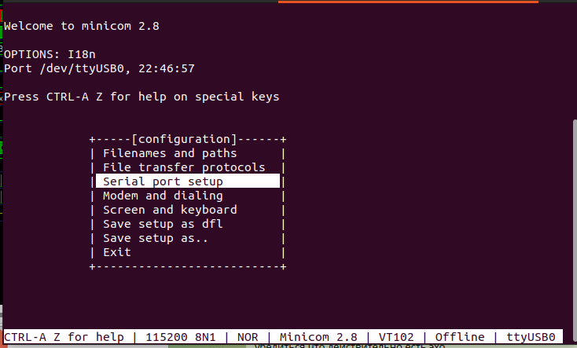

# Setting up the program minicom

## Launching the program

```
sudo minicom -D /dev/ttyUSB0
```
The -D parameter passes the name of the device, usually /dev/ttyUSB0, but it can be different.

## Configuration

Configuration should be done when calling the program via sudo

1. In the minicom terminal, press Ctrl+A, then Z. A window with a list of commands will appear


2. Press 'o'. The setup window will appear


3. Select the item :Serial port setup". The setup window will appear.


The following parameters must be set:
* Bps/Par/Bits: 115200 8N1
* Hardware Flow control: No
* Software Flow control: No

The set parameters must be saved as default parameters.

* Press ESC - you will return to the setup window


## Launch via script

There is a script in the lab directory ./13_run_serial_terminal.bash

The script will launch the program depending on the type of operating system.

For Linux, the script checks two conditions
* The presence of the uart.conf file
* The presence of a user in the group used in the device

For most systems, the device name will be /dev/ttyUSB0 which is included in the dialout group.

The uart.conf file must contain one line with the name of the selected serial port device.

You can create the file with the command: echo /dev/ttyUSB0 > uart.conf

Instead of "/dev/ttyUSB0", you must substitute the name of the serial port device.

You can include a user in a group with the command: sudo usermod -a -G dialout $USER

The command requires sudo privileges, instead of dialout, you must substitute the name of the group to which the selected serial port device belongs.

If these conditions are not met, the script will not launch the minicom program, a brief instruction will be displayed on the screen.

If the conditions are met, the minicom program will be launched.

When configuring the minicom program, you must disable the hardware readiness check, otherwise the characters will not be transmitted to the UART
* Hardware Flow control: No