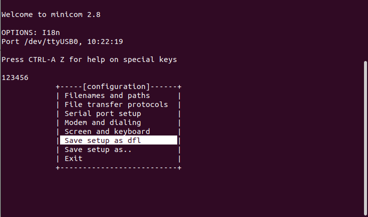

# Настройка программы minicom

## Запуск программы

```
sudo minicom -D /dev/ttyUSB0
```
Параметр -D передаёт имя устройства, как правило это /dev/ttyUSB0, но может быть и другим.

## Конфигурирование

Конфигурацию надо проводить при вызове программы через sudo

1. В терминале minicom нажмите  Ctrl+A, затем Z. Появится окно со списком команд


2. Нажмите 'o'. Появится окно настройки


3. Выберете пунк :Serial port setup". Появится окно настройки. 


  Должны быть установлены параметры:
* Bps/Par/Bits: 115200 8N1
* Hardware Flow control: No
* Software Flow control: No

Установленные параметры надо сохранить как параметры по умолчанию.

* Нажмите ESC - будет выполнен возврат в окно настройки



##  Запуск через скрипт


В каталоге лабораторной работы есть скрипт ./13_run_serial_terminal.bash

Скрипт запускат программу в зависимости от типа операционной системы.

Для системы Linux скрипт проверяет два условния
* Наличие файла uart.conf
* Наличия пользователся в группе которая используется в устройстве 

Для большинства систем именем устройства будет /dev/ttyUSB0 которое включено в группу dialout

Файл uart.conf должен содержать одну строку с именем устройства выбранного последовательного порта.

Создать файл можно командой:  echo /dev/ttyUSB0 > uart.conf

Вместо "/dev/ttyUSB0" необходимо подставить имя устройства последовательного порта.

Включение пользователя в группу выполняется командой: sudo usermod -a -G dialout $USER

Команда требует привилегий sudo, вместо dialout необходимо подставить имя группы к которой принадлежит выбранное устройство последовательного порта.

При несоблюдении этих условий скрпит не будет запускать программу minicom, на экран будет выдана краткая инструкция.

Если условия выполняются, то будет запущена программа minicom.


При настройке программы minicom необходимо отключить проверку аппаратной готовности иначе символы не будут передаваться в UART
  * Hardware Flow control: No

