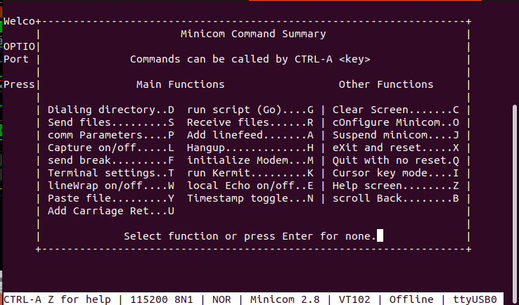
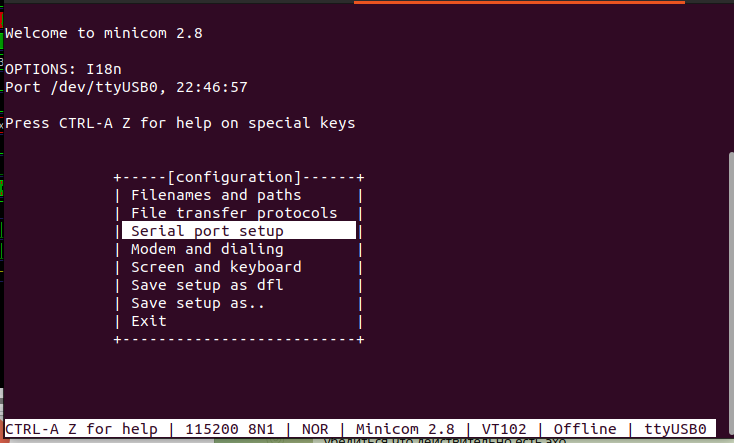
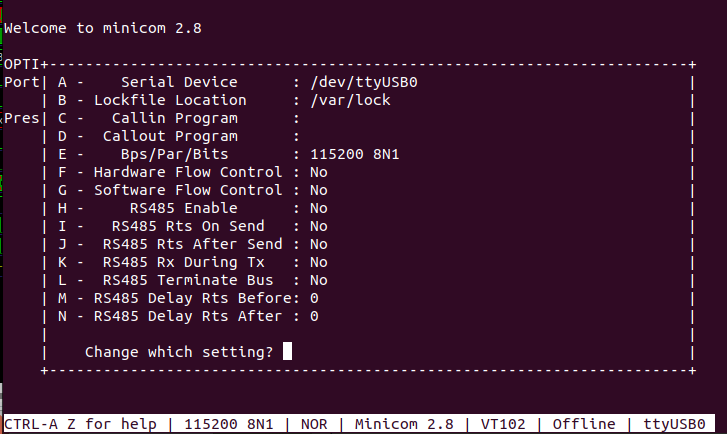

# Настройка программы minicom

## Запуск программы

```
sudo minicom -D /dev/ttyUSB0
```
Параметр -D передаёт имя устройства, как правило это /dev/ttyUSB0, но может быть и другим.

## Конфигурирование

1. В терминале minicom нажмите  Ctrl+A, затем Z. Появится окно со списком команд


2. Нажмите 'o'. Появится окно настройки


3. Выберете пунк :Serial port setup". Появится окно настройки. 


  Должны быть установлены параметры:
* Bps/Par/Bits: 115200 8N1
* Hardware Flow control: No
* Software Flow control: No
    

