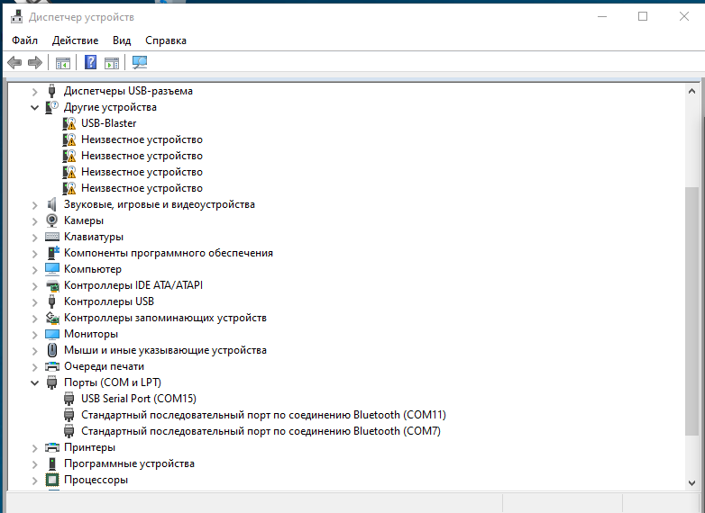
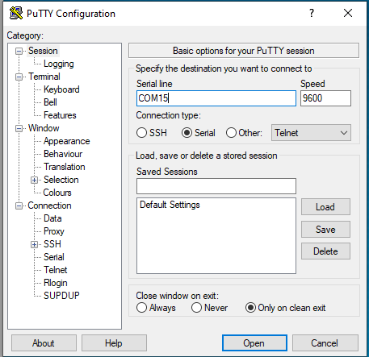
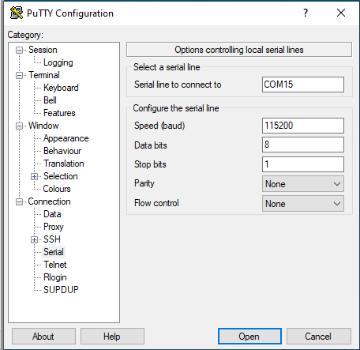

# Setting up the program Putty

# Setting up the Putty program

The Putty program is used to work with the serial port in the Wondows system.

The program can be downloaded here: https://www.chiark.greenend.org.uk/~sgtatham/putty/latest.html

It is necessary to determine the serial port number to which the debug board is connected via the device manager.

The port should appear in the "COM and LPT ports" section, in the picture below it is COM15

* Run Putty
* Select "Connection type:" - Serial

* On the Connection/Serial tab, set the parameters:
* Speed: 115200
* Data bits: 8
* Stop bits: 1
* Parity: None
* Flow control: None

* Return to the Session tab
* Enter having a COM_BOARD session
* Save the session

When launched via the ./13_run_serial_terminal.bash script, the COM_BOARD session will be loaded